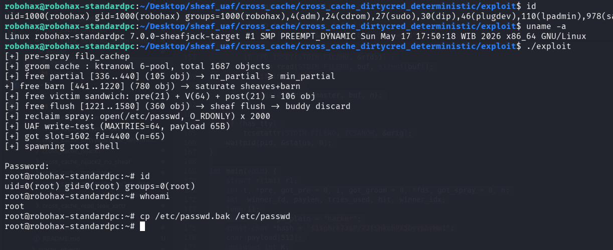

# cross_cache_dirtycred_deterministic

>cross cache dirty cred p0c for linux 7.0 - deterministic (by engineer)
>
>mechanism:
>
>Step 1 .pre-spray filp_cachep (open dummy x NPRE)
> Step 2 .groom cache A: CCX_ALLOC slot 0..NGROOM-1
>Step 3 .free BURNER_PRE  -> saturate sheaves+barn + raise nr_partial
>Step 4. free V (TARGET pool) -> 64 dangling slots at slabs 0..3
>Step 5. free F (filler)  -> fill slab 3 -> inuse=0
>Step 6. free BURNER_POST -> trigger flush event to discard
>Step 7. reclaim spray open(/etc/passwd) x NSPRAY -> filp_cachep grab fresh page from buddy
>Step 8. ITERATIVE UAF write + write-test (MAXTRIES=64)
>Step 9. RESTORE bytes original (cleanup safety)
>Step 10.close NPRE+NSPRAY fds
>Step 11.forkpty(su - hacker) auto-password -> root shell
>
>
>Compile : gcc -static -o exploit exploit.c
>Antonius (w1sdom / sw0rdm4n) - bluedragonsec.com - for linux 7.0
>
>Compile the LKM and then insmod before run the exploit.
 
 
 
