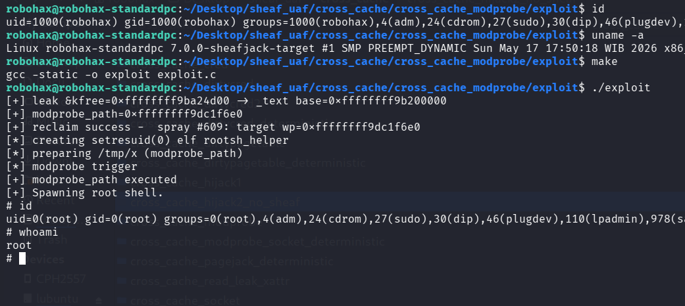

# Cross Cache UAF Exploitation pOc for Linux 7.0 Slub Sheaves (modprobe method)

>Cross cache UAF exploitation pOc for linux kernel 7.0 slub sheaves using modprobe for LPE. An UAF read for information leak & UAF write for LPE.

Compile the LKM and then insmod before run the exploit.

btw, If you run any other exploit previously, the lpe might fail, please restart your machine !

