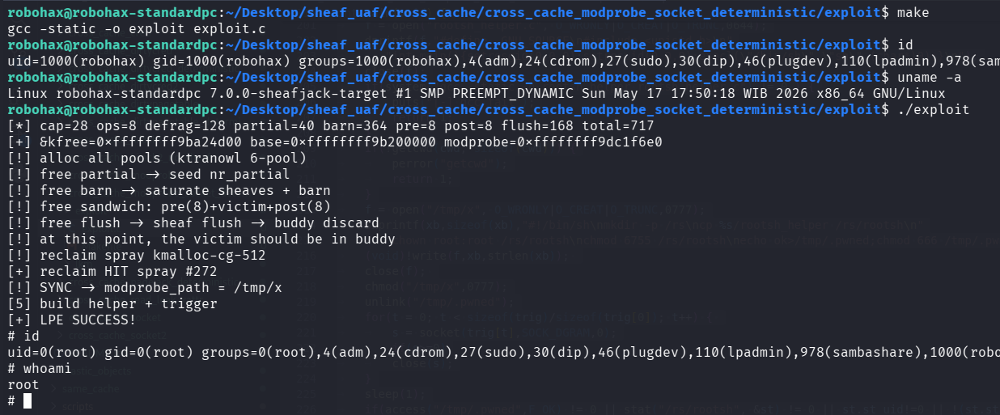

# Cross Cache UAF Exploitation pOc for Linux 7.0 Slub Sheaves Deterministic Method

>Cross cache UAF exploitation pOc for linux kernel 7.0 slub sheaves using Deterministic cross cache strategy from ktranowl.

https://blog.ktranowl.site/posts/cross-cache-attacks-slub-sheaf-barn-mechanism-linux-7-1/

Compile the LKM and then insmod before run the exploit.

