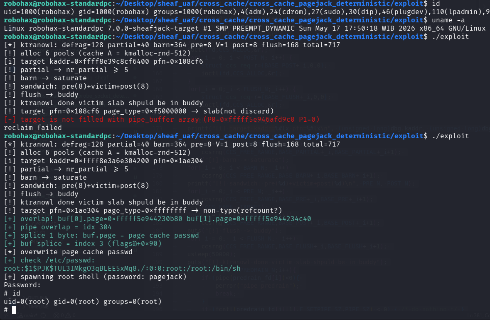

# Cross Cache UAF Exploitation pOc for Linux 7.0 Slub Sheaves Deterministic Method

>Cross cache UAF exploitation pOc for linux kernel 7.0 slub sheaves using PageJack.
Deterministic cross cache strategy from ktranowl.

Compile the LKM and then insmod before run the exploit.

