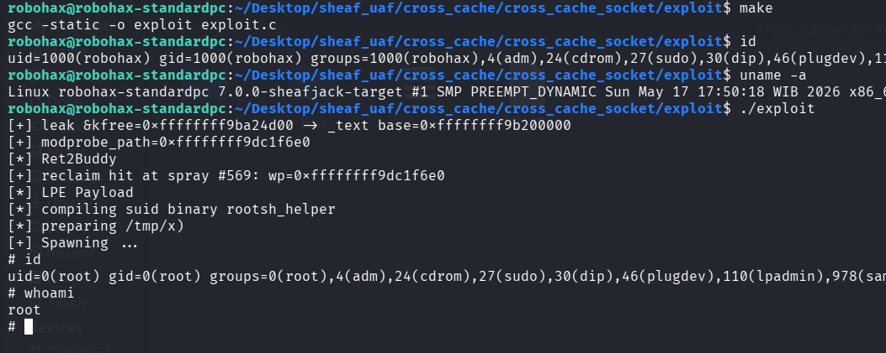

# Cross Cache UAF Exploitation pOc for Linux 7.0 Slub Sheaves.

>Cross cache UAF exploitation pOc for linux kernel 7.0 slub sheaves. ret2buddy is accomplished by draining the main sheaf, spare sheaf, saturate the barn, once return to slab, I force a condition where the kernel jmp to slab_empty, this one will return to buddy.
mm/slub.c (linux kernel 7.0) line 5547:
	if (unlikely(!new.inuse && n->nr_partial >= s->min_partial))
		goto slab_empty;
what's there in slab_empty ? discard_slab() !!! -> this one is the path for return to buddy !!!

## Cross Cache Drain Mechanic

The cross cache reclaim drains victim_obj's backing page out of cache A through the sheaves+barn pipeline into the buddy allocator, then reallocates that page through a different consumer:

**[1] BURNER_PRE phase.** The attacker fills cache A's sheaves and barn, leaving one free slot in main. victim_obj's slab holds only attacker objects plus victim_obj.

```
pre_state: pcs->main->size == capacity-1
           pcs->spare full
           barn full of full sheaves
           victim's slab: all slots free except victim_obj
```

**[2]** The victim_obj is freed, call its pointer victim_ptr.

```c
pcs->main->objects[pcs->main->size++] = victim_ptr;
```

main is now full. victim_ptr sits on top of main's LIFO.

**[3] BURNER_POST phase.** The attacker frees N more same cache objects to push victim_ptr down the drain pipeline:

```
a. main full -> swap with spare (or flush into barn).
   victim_ptr migrates main -> spare/barn.
b. Continued frees fill the remaining sheaves until barn rejects,
   forcing the __slab_free slow path.
c. Excess frees bypass sheaves:
   __slab_free(s, slab, victim_ptr) returns victim_ptr to the
   slab freelist.
d. slab->inuse drops to 0 -> discard_slab(s, slab).
e. free_slab -> __free_pages -> page returns to buddy.
   Cache A no longer owns it.
```

**[4]** The attacker triggers a page granularity allocation in a different consumer:

```
Option 1 - different cache :
    alloc in cache B with no partial -> allocate_slab(B)
    -> __alloc_pages -> buddy returns the victim's page.

Option 2 - non slab reclaim:
    page table page, pipe_buffer page, vmalloc page, etc.
    -> __alloc_pages -> buddy returns the victim's page.
```

**[5]** attacker_obj is initialized on that page through the new consumer's allocation path. With deterministic grooming, attacker_ptr lands at the offset victim_ptr occupied.

**[6]** Field overlap engineered by attacker: craft attacker_obj so an attacker controlled field at offset X overlaps a useful field of victim_obj at offset X. Under Route C2 with PTE reclaim, the "field" at offset X is a page table entry. Controlling it is Dirty Pagetable reached via the drain path.

**[7]** victim_ptr is dereferenced by the kernel. Offset X holds attacker (or PTE) controlled bytes.
Compile the LKM and then insmod before run the exploit.



