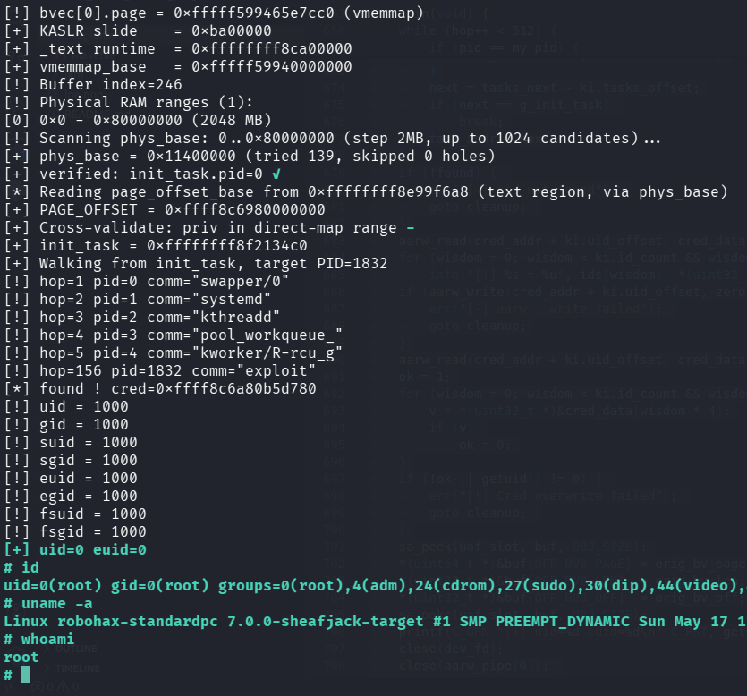

# Cross Cache UAF Exploitation pOc for Linux 7.0 Slub Sheaves using Elastic Object Method - Deterministic

>Cross cache UAF exploitation pOc for linux kernel 7.0 slub sheaves.
>
>Build AARW primitive using elastic object io_mapped_ubuf -> lpe strategy after gaining aarw primitive is by walking through init_task.
>
>reference : https://bluedragonsec.com/page/writing/id/12
>
>Deterministic cross cache using kratnowl 6-pool.
>
>reference : https://blog.ktranowl.site/posts/cross-cache-attacks-slub-sheaf-barn-mechanism-linux-7-1/
>
>Compile the LKM and then insmod before run the exploit.

