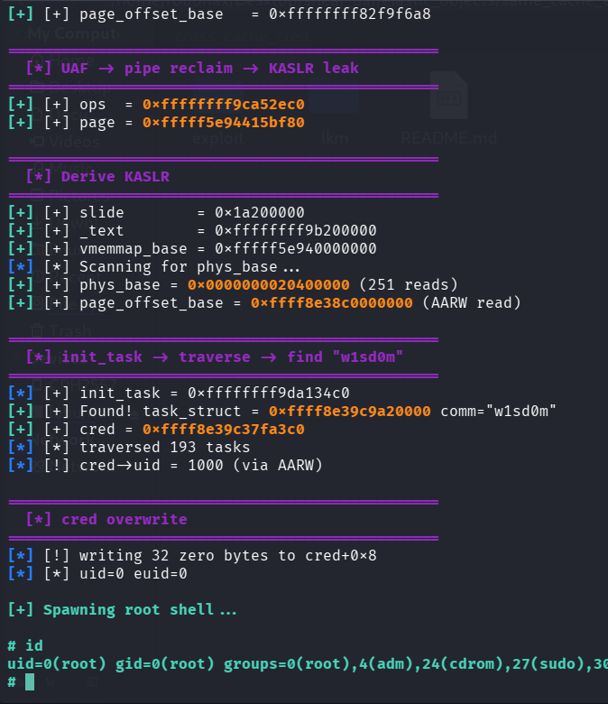

# Same Cache UAF Exploitation pOc for Linux 7.0 Slub Sheaves using Elastic Object Method - Deterministic

>Same cache UAF exploitation pOc for linux kernel 7.0 slub sheaves.
Build AARW primitive using elastic object pipe_buffer, lpe : cred overwrite
reference : https://bluedragonsec.com/page/writing/id/12

Compile the LKM and then insmod before run the exploit.

