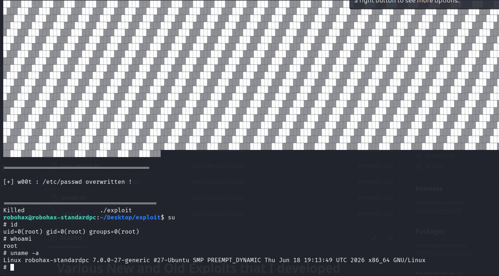
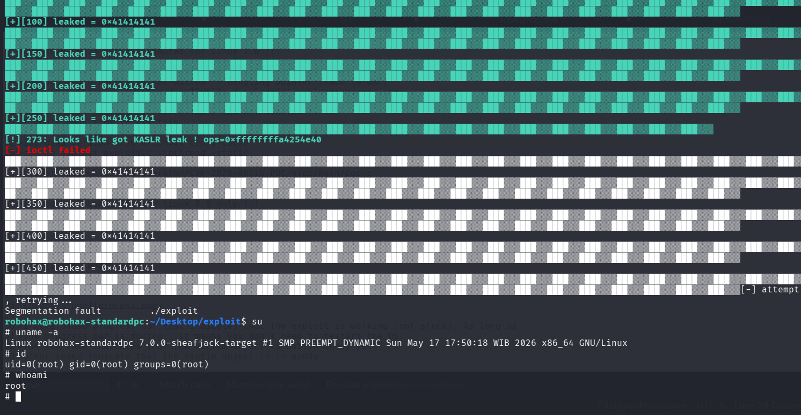
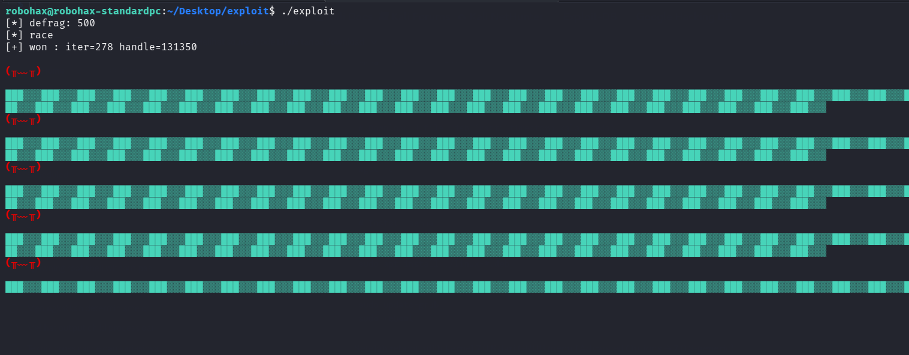

# CVE-2026-46215 Exploit for Linux 7.0 

>c0d3 by : Antonius (w1sdom / ev1lut10n / sw0rdm4n) - bluedragonsec.com
>
>https://github.com/bluedragonsecurity
>
>This exploit works in a limited environment, check some requirements below !!!

## WHAT THE HELL IS THIS ?

>This is an exploit for CVE-2026-46215 (Linux Kernel Use After Free) Adapted for Linux 7.0 !!!
>
>WARNING !!! this exploit is not stable ! sometimes, this exploit might cause kernel panic ! you have been warned !!! ;-p
>
>Please be patient ... the exploitation process might be long.
>
>The bug ? old handle is not nulled -> dangling pointer (race to UAF)
>
>Sorry ! this exploit is not reliable and not stable !!!
>
>I don't have time to fix this.
>
>Please be patient when running this exploit ! this will take a long time !
>
>improved version from kratnowl cross-cache
>
>gcc -o exploit exploit.c -lpthread -static
>
>This exploit is  adapted from 
>https://github.com/0xCyberstan/CVE-2026-46215-POC/blob/main/poc.c
>
>This exploit was designed for linux 7.0 but 
>The vulnerability is from 7.0 to 7.0.8, including 7.0-rc* series
>
>Tested on lubuntu 26 with linux 7.0 only !!!

## LPE

# REQUIREMENTS

## HOW TO TEST IN QEMU ?

>Use lubuntu 26 or ubuntu 26 or ubuntu 26 server with linux 7.0.
>
>linux 7.0.1 -  7.0.8 is vulnerable, but I didn't design this exploit for other version that 7.0
>but you can try, maybe this exploit will works (I didn't try any other version that linux 7.0)
>
>n.b : this exploit is designed for linux 7.0.

>Use this command (just an example):
>qemu-system-x86_64 \
  -machine type=q35,accel=kvm \
  -enable-kvm -cpu host -smp $(nproc) -m 6G \
  -drive file=lubuntu26.qcow2,format=qcow2,if=virtio,cache=none,aio=io_uring,discard=unmap \
  -netdev user,id=n0,hostfwd=tcp::2222-:22 \
  -device virtio-net-pci,netdev=n0 \
  -device virtio-rng-pci -device virtio-balloon \
  -vga virtio -display spice-app \
  -device virtio-serial-pci \
  -chardev spicevmc,id=spicechannel0,name=vdagent \
  -device virtserialport,chardev=spicechannel0,name=com.redhat.spice.0 \
  -device qemu-xhci,id=xhci \
  -device usb-tablet,bus=xhci.0 -device usb-kbd,bus=xhci.0 \
  -rtc base=utc,clock=host \
  -serial mon:stdio \
  -s

## WORKS IN TEXT MODE ONLY
>To make this exploit works, the OS needs to be in text mode.
>
>For lubuntu 26 or ubuntu 26, do this before testing the exploit :
>
>sudo systemctl set-default multi-user.target &&  reboot

## THIS EXPLOIT WILL WORKS FOR USERS IN VIDEO GROUP
>To avoid this error : [-] No DRM, for lubuntu the user must be in video group, do this before run the exploit:
>
>sudo usermod -a -G video your_username && newgrp video
>
>e.g my user : robohax, so :
>
>sudo usermod -a -G video robohax && newgrp video
>
>Testing :
>
>robohax@robohax-standardpc:~$ id
>
uid=1000(robohax) gid=1000(robohax) groups=1000(robohax),4(adm),24(cdrom),27(sudo),30(dip),44(video),46(plugdev),110(lpadmin),978(sambashare)

>44(video) ===> this is needed to open /dev/dri !!!

## PROCESS

>I have added progress bar that indicates that the exploit is working (not stuck).
>
> As long as 
>the progress bar is moving...it means you don't need to restart the OS.
>

