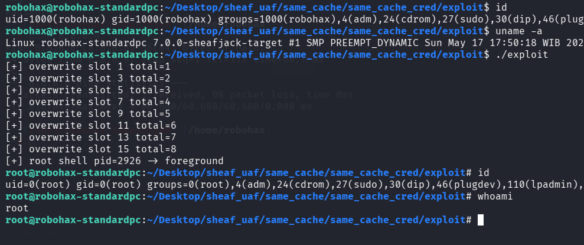

# Same Cache UAF Exploitation pOc for Linux 7.0 Slub Sheaves using Cred Overwrite

>Same cache UAF exploitation pOc for linux kernel 7.0 slub sheaves using Cred Overwrite.
Without information leak to bypass KASLR.  Just reading the dangling pointer for verifier. 

Compile the LKM and then insmod before run the exploit.

