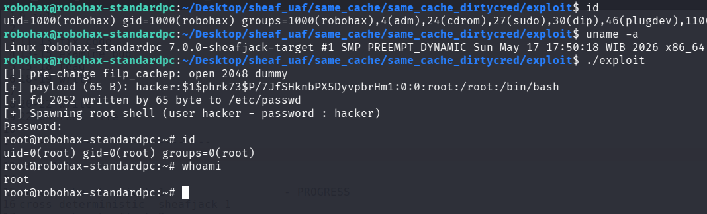

# Same Cache UAF Exploitation pOc for Linux 7.0 Slub Sheaves using DirtyCred

>Same cache UAF exploitation pOc for linux kernel 7.0 slub sheaves using dirtycred f_mode overwrite for LPE. Without information leak at all..

Compile the LKM and then insmod before run the exploit.

