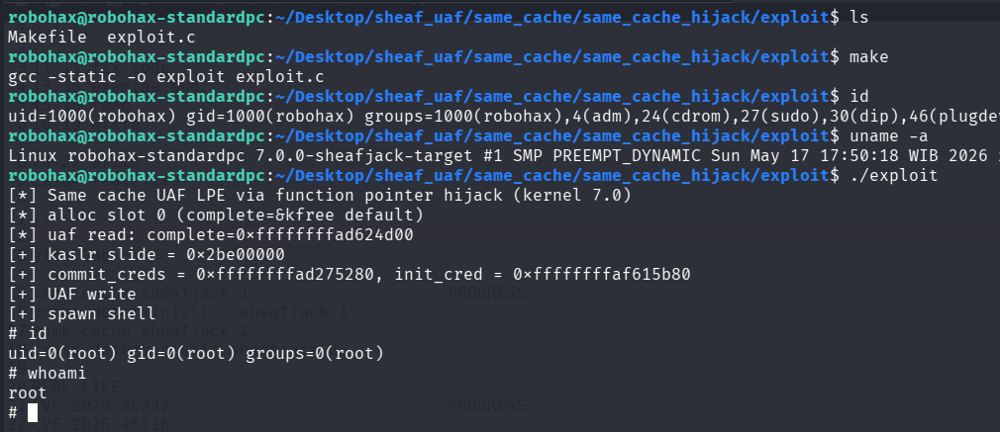

# Same Cache UAF Exploitation pOc for Linux 7.0 Slub Sheaves (function pointer hijack)

>Same cache UAF exploitation pOc for linux kernel 7.0 slub sheaves using function pointer hijack for LPE. An UAF read for information leak & UAF write for LPE..

Compile the LKM and then insmod before run the exploit.

