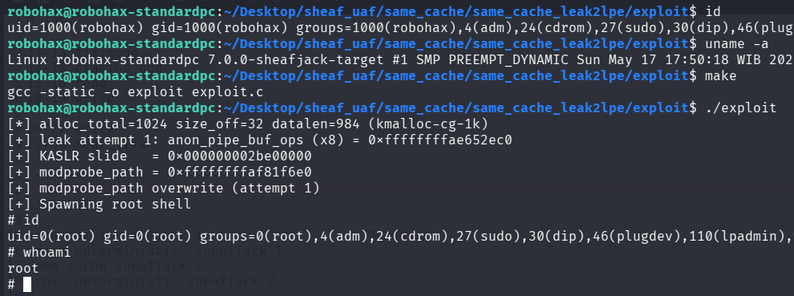

# Same Cache UAF Exploitation pOc for Linux 7.0 Slub Sheaves (from single UAF write to LPE)

>Same cache UAF exploitation pOc for linux kernel 7.0 slub sheaves using modprobe for LPE. Converting a single UAF write into information leak & LPE.

Compile the LKM and then insmod before run the exploit.

