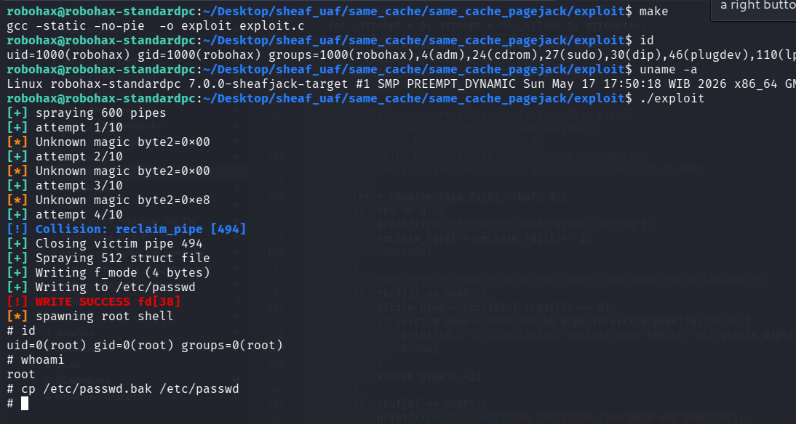

# Same Cache UAF Exploitation pOc for Linux 7.0 Slub Sheaves (using pagejack + dirtycred)

>Same cache UAF exploitation pOc for linux kernel 7.0 slub sheaves using pagejack + dirtycred.

Compile the LKM and then insmod before run the exploit.

