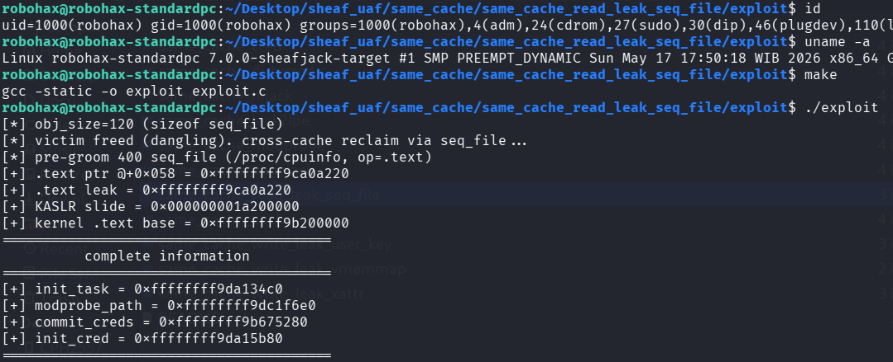

# Same Cache UAF Exploitation pOc for Linux 7.0 Slub Sheaves (UAF read information leak)

>Same cache UAF read information leak pOc using seq_file. No LPE, just info leak.

Compile the LKM and then insmod before run the exploit.

