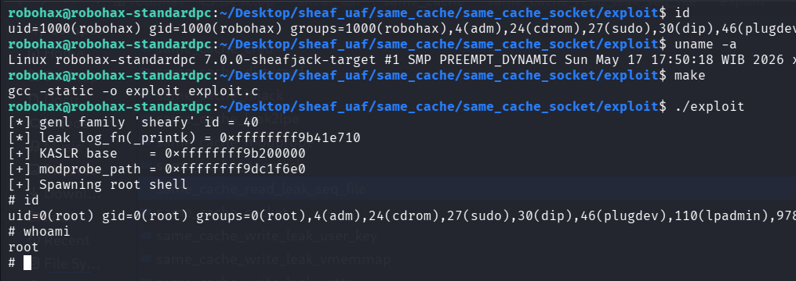

# Same Cache UAF Exploitation pOc for Linux 7.0 Slub Sheaves (socket communication)

>Same cache UAF exploitation pOc for linux kernel 7.0 slub sheaves using modprobe for LPE. Communication via socket. An UAF read for information leak & UAF write for LPE.

Compile the LKM and then insmod before run the exploit.

