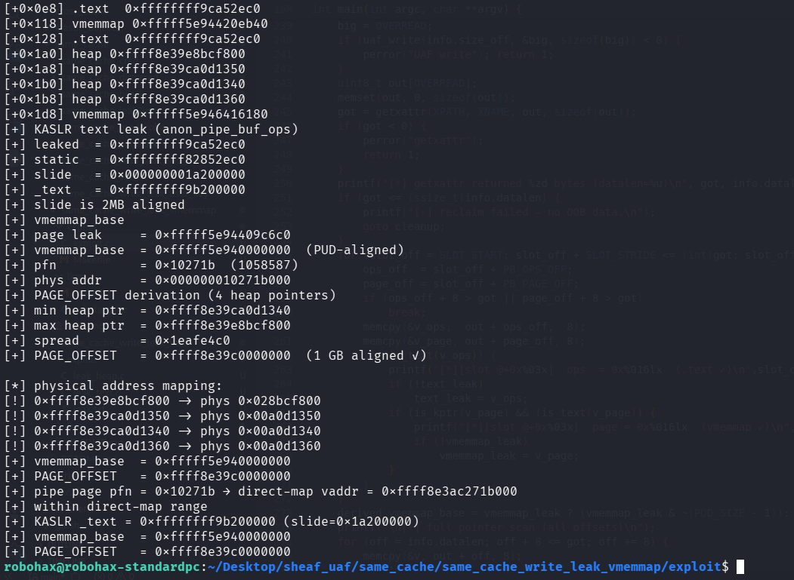

# same_cache_write_leak_vmemmap

>Same cache UAF write information leak pOc using simple_xattr. No LPE, just info leak. Converting an UAF write into information leak.
For Linux 7.0. more complete leaks : vmemmap_base, page offset

Compile the LKM and then insmod before run the exploit.

