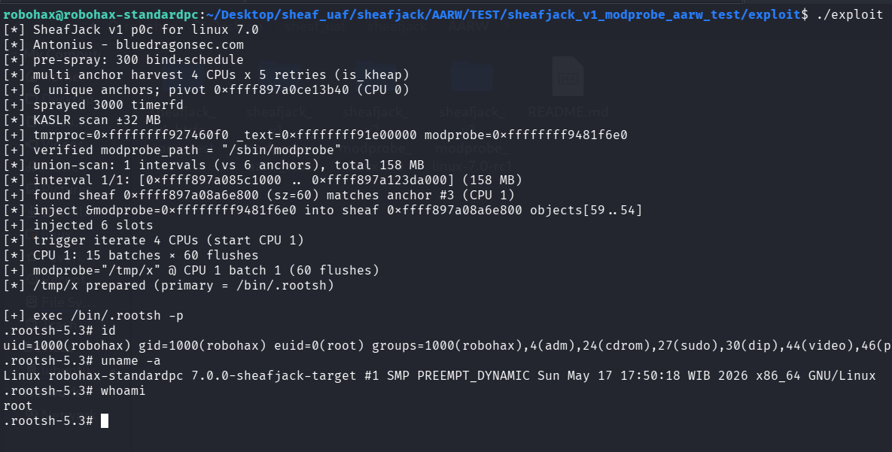

# sheafjack_modprobe_aarw_test

>SheafJack  - direct objects[] overwrite testing - non UAF, just AARW for testing & validating the exploitation technique. Result : LPE.
>
>>Improvisation : deep sheaf poisoning
>
Compile the LKM and then insmod before run the exploit. Tested on Linux 7.0 - lubuntu 26.

