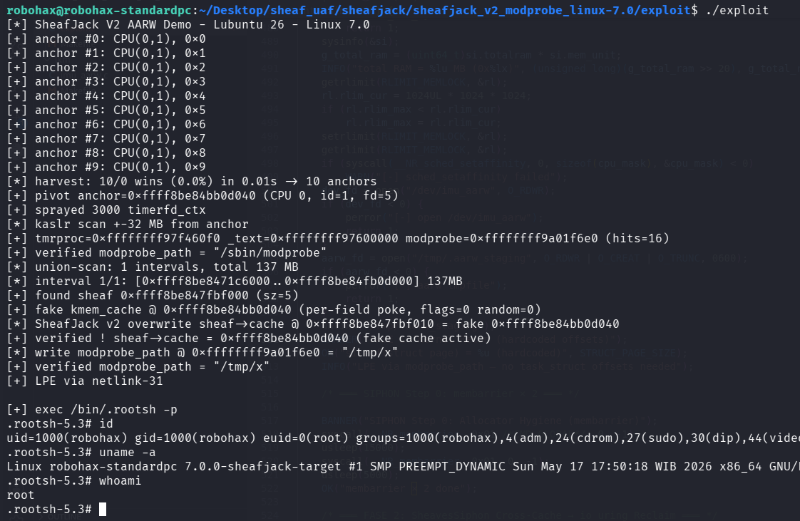

# sheafjack_v2_modprobe_linux-7.0

>SheafJack v2 - cache pointer overwrite testing - non UAF, just AARW for testing & validating the exploitation technique. Result : LPE.

Compile the LKM and then insmod before run the exploit. Tested on Linux 7.0 - lubuntu 26.

