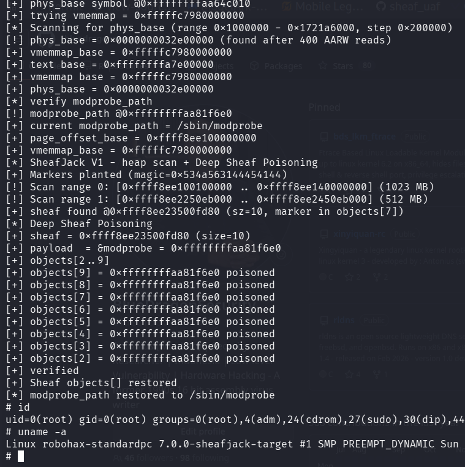

# same_cache_sheafjack_elastic_pipe

>same cache UAF demo using SheafJack 
>
>Antonius (w1sdom / sw0rdm4n) - bluedragonsec.com - for linux 7.0
>
>Compile the LKM and then insmod before run the exploit.
>
>Same cache reclaim with pipe_buffer -> build AARW -> heap scan -> direct objects[] overwrite 
>
>Improvisation : Deep Sheaf Poisoning
>
 
 
 
