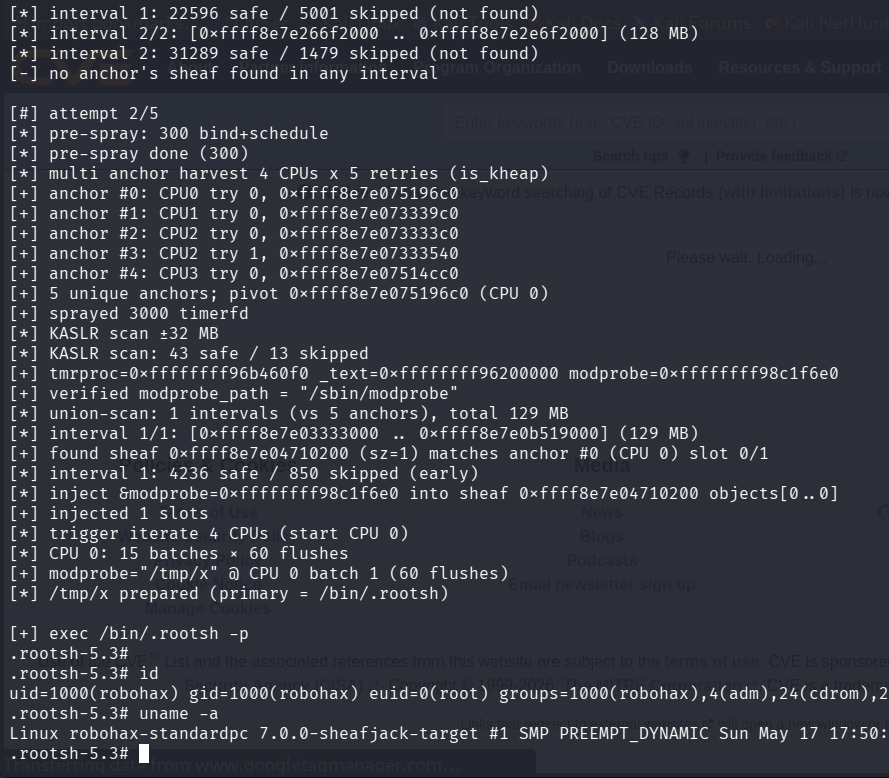

# sheafjack_v1_modprobe_aarw_test

>SheafJack v1 - direct objects[] overwrite testing - non UAF, just AARW for testing & validating the exploitation technique. Result : LPE.

Compile the LKM and then insmod before run the exploit.

